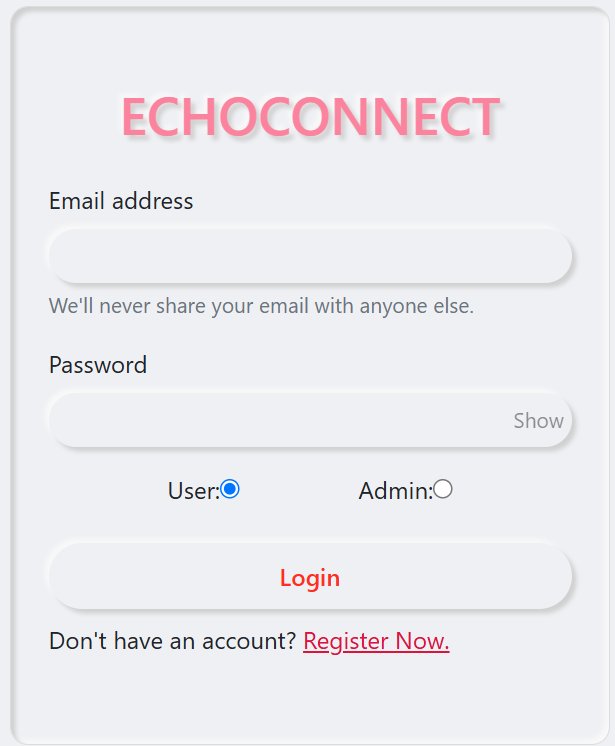
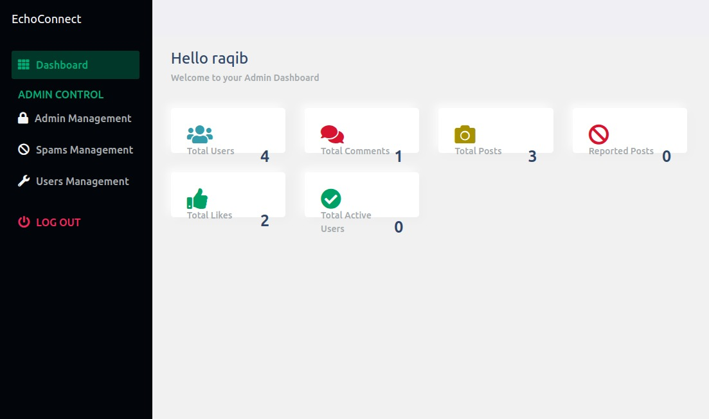
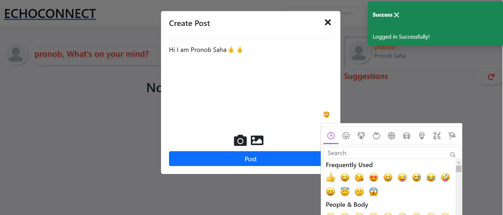
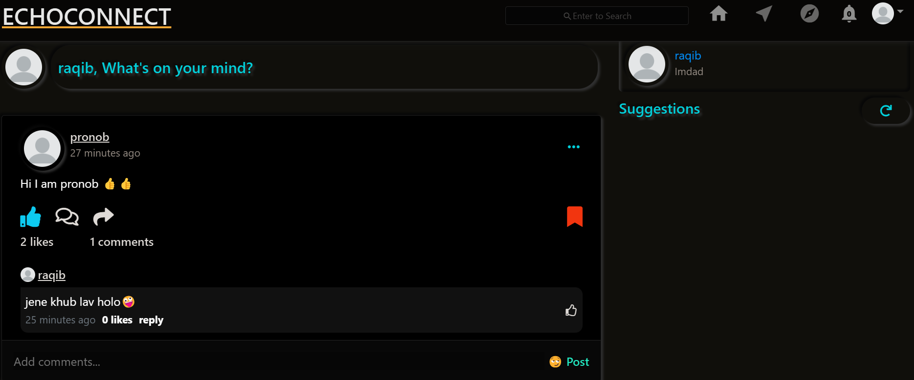
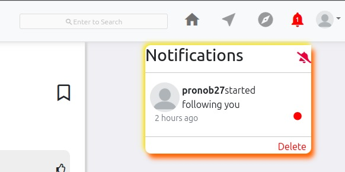
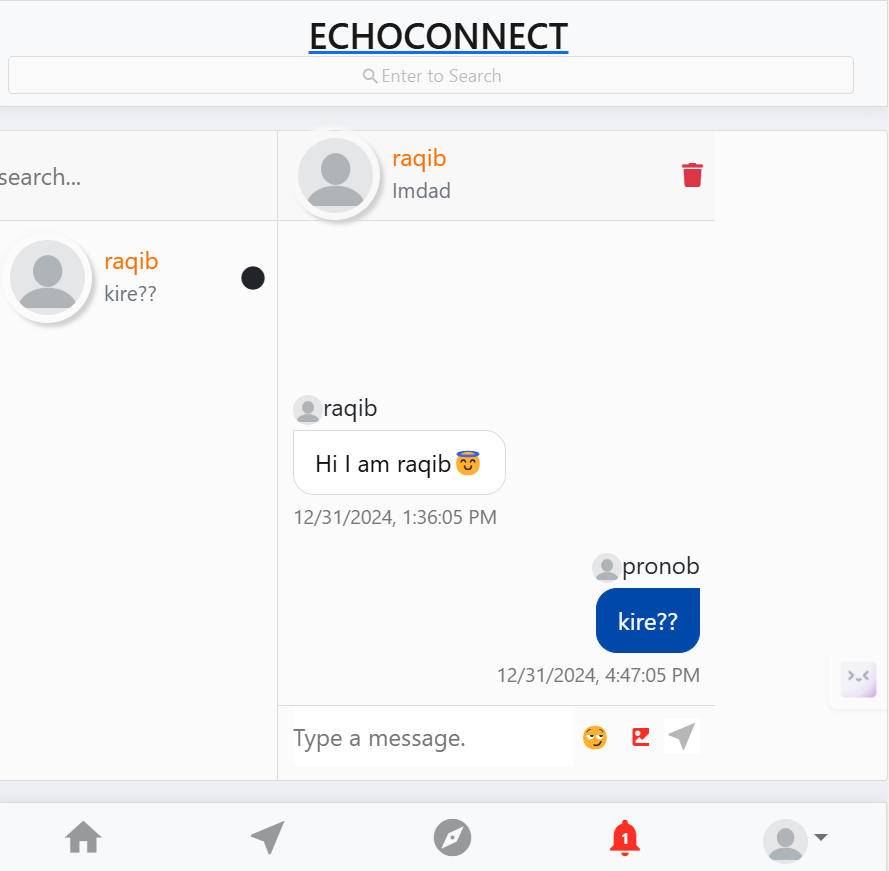

# EchoConnect
A MERN stack based project on blog post application. It is completely working project. Its' completely responsive application.
MongoDB Express React Redux NodeJs are user in this project.

# Featurs included in this project:

**user features:**
 - register and login users. 
 - post images can be uploaded using camera or file system.
 - pagination on every pages.
 - Dark mode.
 - copy link of post.
 - report post for spam.
 - search other users by username.
 - user suggestions menu. 
 - save any post to collection(Partially completed).
 - saved posts page.
 - delete posts and comments.
 - admin panel is included.
 - Explore page to view other posts by random users.
 - notifications page.
 - profile page.
 - edit profile page user data.
 - password is stored in database in encrypted format with salt.
 - create and edit posts.
 - like ,comment, share and edit posts.
 - posts include text(caption) and image(s).
 - comment on posts.
 - reply comments.
 - like commets.
 - clear notification option.
 - profile page shows user details and posts with following and followers menu.

   **Admin features:**
   

 - admin panel shows total number of post ,users,reported posts etc.
 - admin can create or assign other admin accounts.
 - admin can see posts reported by more than specified number of users.
 - admin can delete those reported posts.(partially completed)

**What you need to run this application:**

 - Node 
 - MongoDB or Mongo Atlas
 - Cloudinary account
 - NPM

**How to run this application**
1.  Make sure MongoDB is running on your system or online.
2. include MongoDB database link in .env file.
3. Open command line in the cloned folder,
    - To install dependencies for backend, run  `npm install` in main folder.
    - To run backend type command `node server` in main folder.
    - To install dependencies for frontend , run  `npm install` in `/client` folder.
    - To run frontend type command `npm start` in `/client` folder.
4.  Open  [localhost:3000](http://localhost:3000/)  in the browser.
 **And application will be up and running.**
**Here are some images of application:**

